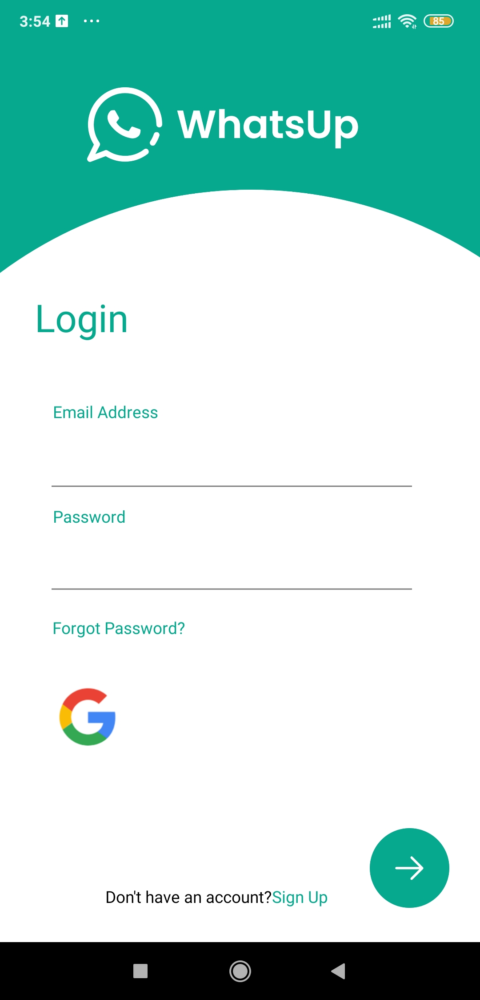
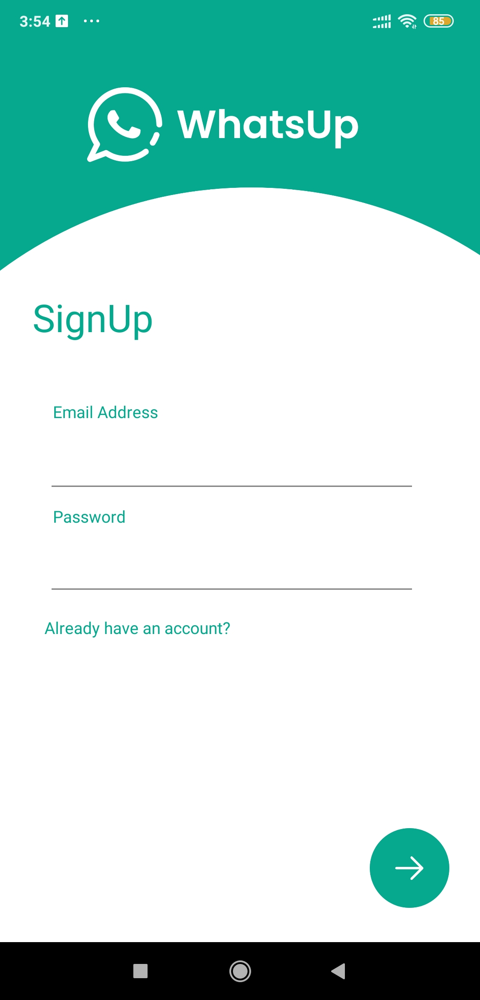
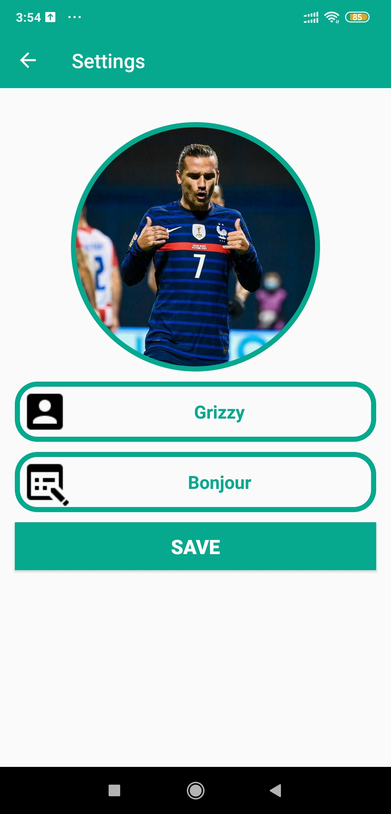
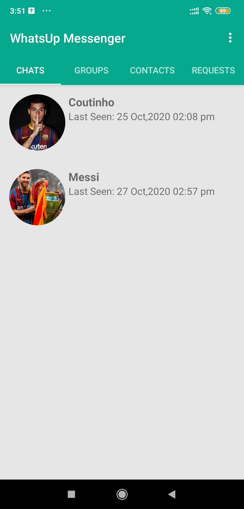
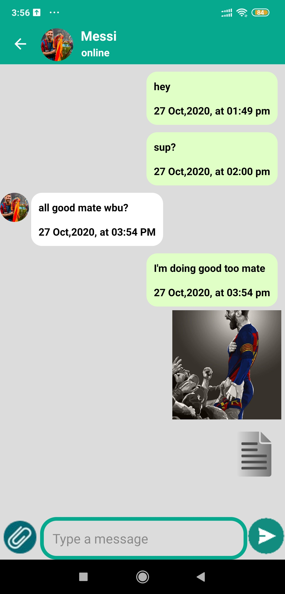
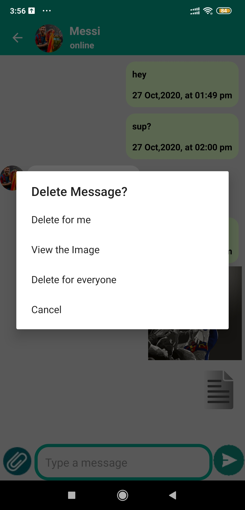
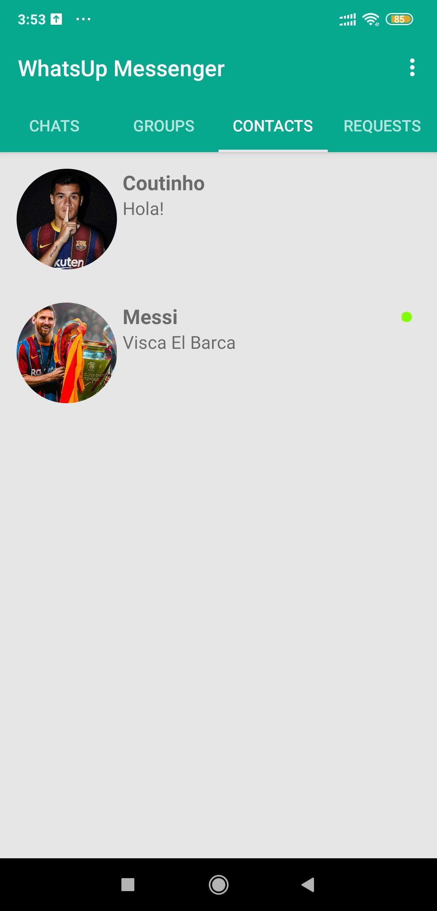
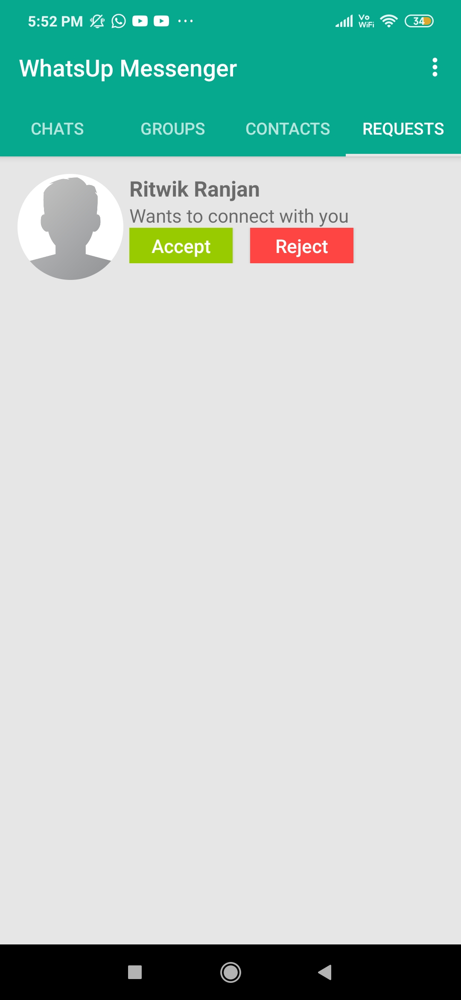

# ChatApp
Download the app from https://drive.google.com/file/d/1ID5XwpRJf47Xk007PtcfOhqL_rXCVHy6/view?usp=sharing

## About
Built an Android App using Java with the functionality for real time chats and have common chat features
like last online, sending docs, images, users can send friend req to other users and then can have direct messaging

## Permission
On Android versions prior to Android 6.0, this ChatApp requires the following permissions:
- Full Network Access.
- Run at startup.
- Read and write access to external storage.

## Libraries this app use
- Firebase - https://firebase.google.com/
- Picasso - https://square.github.io/picasso/
## Screenshots

